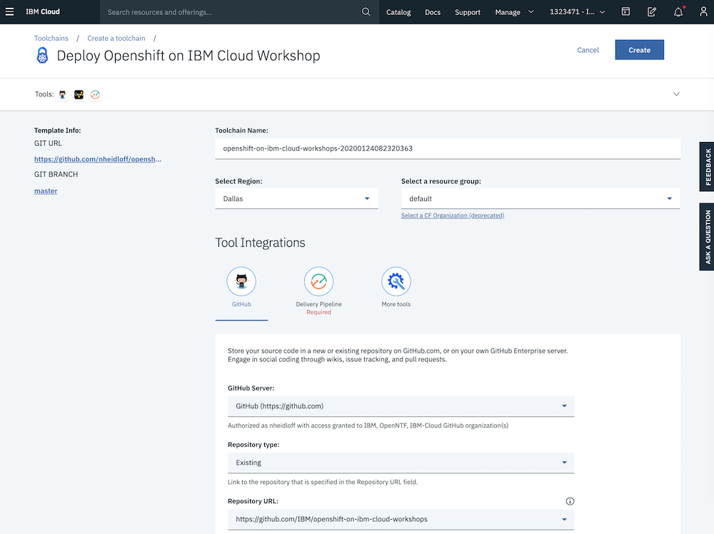
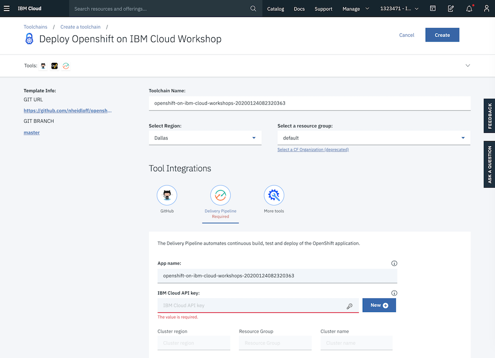
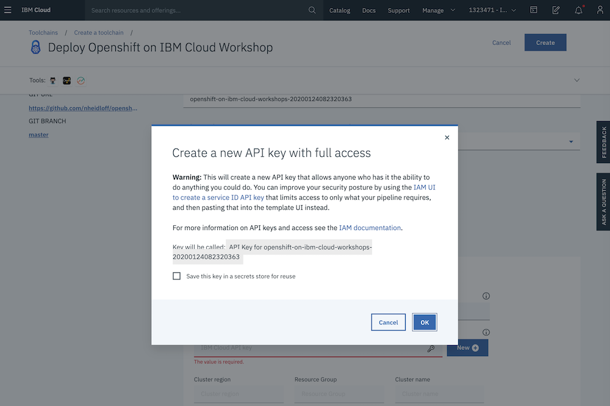
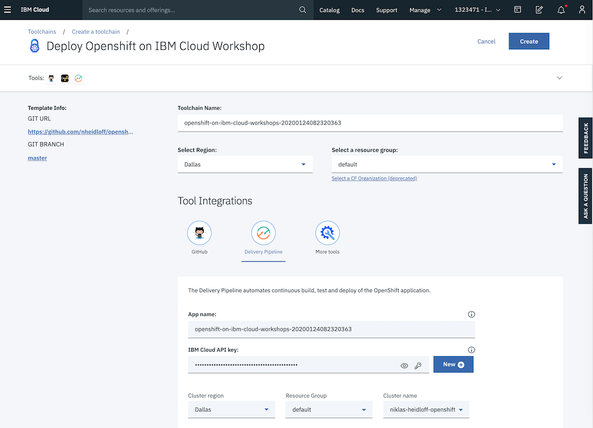

# Toolchain for Workshop 'Deploying Java Microservices to OpenShift on IBM Cloud - Lab 4'

This project contains a toolchain that is run on the IBM Cloud to deploy a lab of an OpenShift workshop for Developers.

Here are pointers to the workshop:

* Workshop: [Deploying Java Microservices to OpenShift on IBM Cloud](https://github.com/IBM/openshift-on-ibm-cloud-workshops/tree/master/2-deploying-to-openshift)
* Lab 4 instructions: [Deploying to OpenShift via 'oc' CLI](https://github.com/IBM/openshift-on-ibm-cloud-workshops/blob/master/2-deploying-to-openshift/documentation/4-openshift.md)
* Lab 4 video: [Deploying to OpenShift via 'oc' CLI](https://youtu.be/4MDfalo2Fg0)

**TL;DR**

In order to use this toolchain, you need an [IBM id](https://cloud.ibm.com/registration) and an OpenShift cluster in the IBM Cloud. Check out the [instructions](https://cloud.ibm.com/docs/openshift?topic=openshift-getting-started) how to create it.

If you understand how toolchains work, you can click this button to create a toolchain on the IBM Cloud which deploys the lab to your cluster.

### Step 1

After clicking the button above, the following page will be opened. 

The workshop project will be cloned to your GitHub account. If this is your first time you use this functionality, you need to grant the toolchain access to your GitHub account. Follow these [instructions](https://cloud.ibm.com/docs/services/ContinuousDelivery?topic=ContinuousDelivery-troubleshoot-cd#i-tried-to-add-the-github-tool-integration-to-my-toolchain-why-wasn-t-the-tool-integration-added-).

<kbd></kbd>

### Step 2

On the Delivery Pipeline tab create a new API key or refer to an existing one.

<kbd></kbd>

When creating a new key, simply click the 'OK' button.

<kbd></kbd>

### Step 3

After the key has been defined, your Kubernetes clusters and OpenShift clusters will be displayed in the combobox. Select the right one. Make sure that you select an OpenShift cluster.

<kbd></kbd>

### Step 4

The pipeline will automatically be triggered. Click on the Delivery Pipeline to see the deployment status.

After the pipeline has run, open the OpenShift web console to see the deployed microservice.